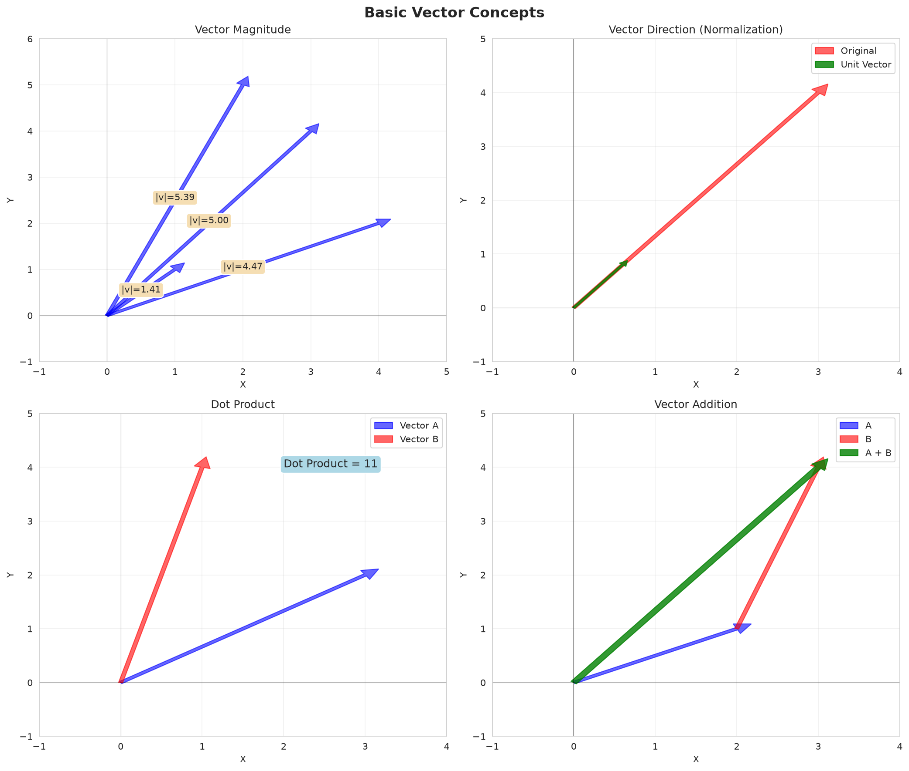
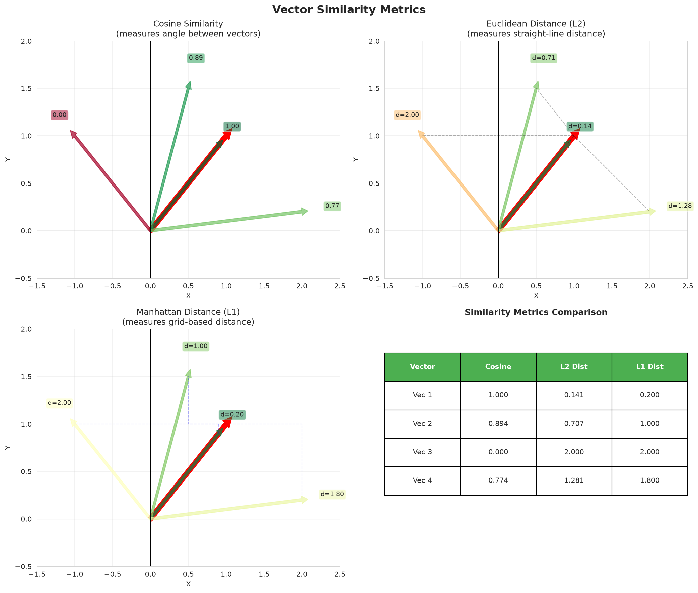
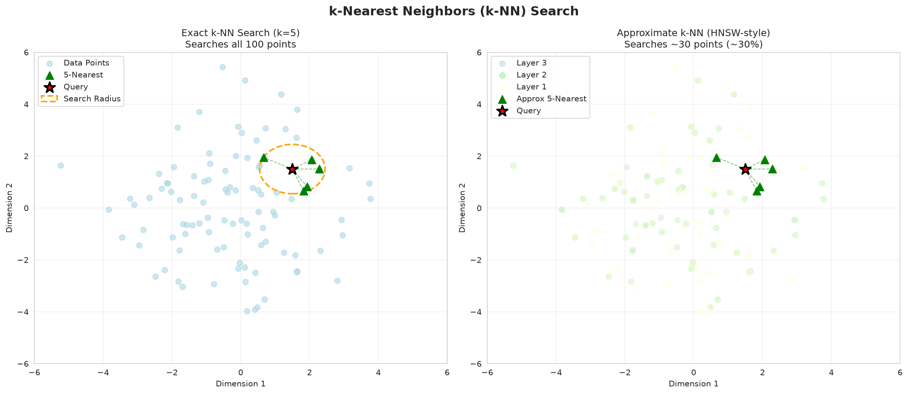
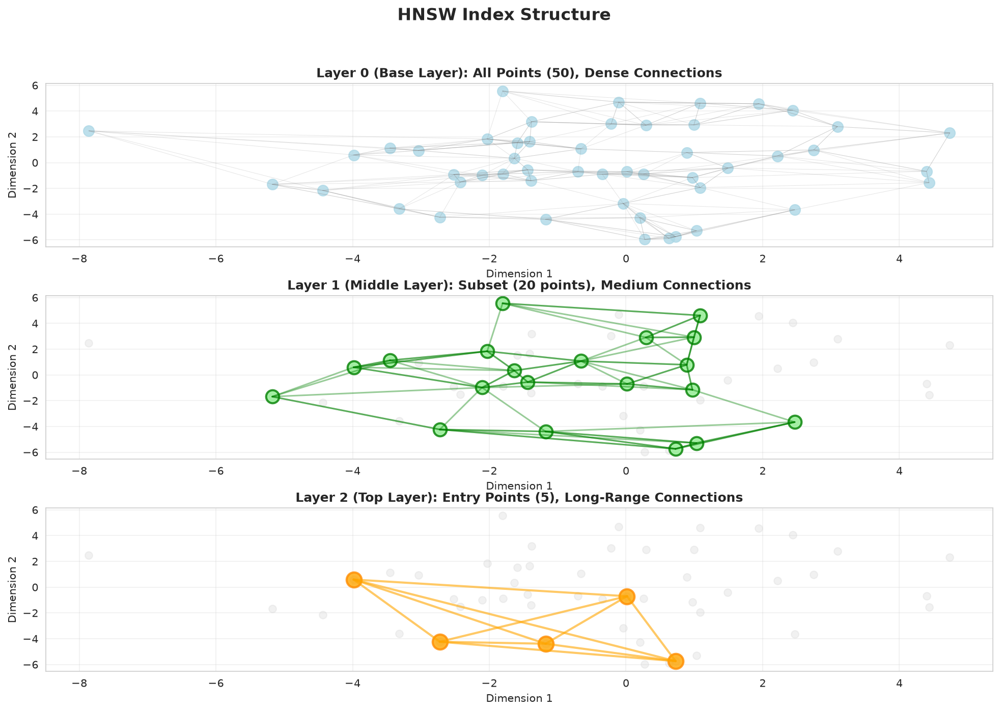
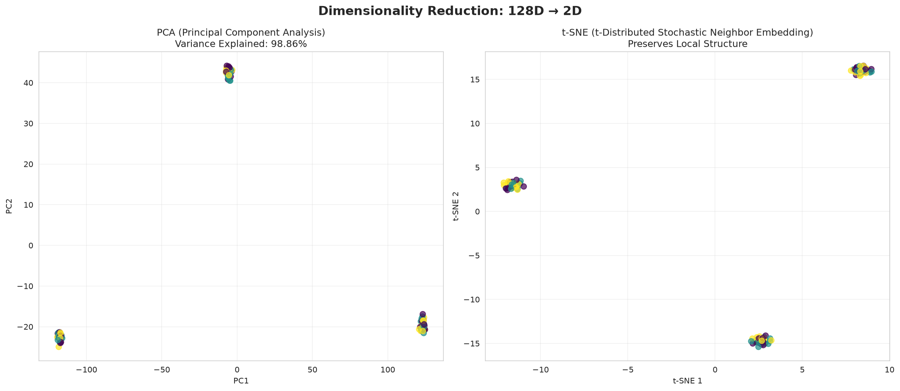
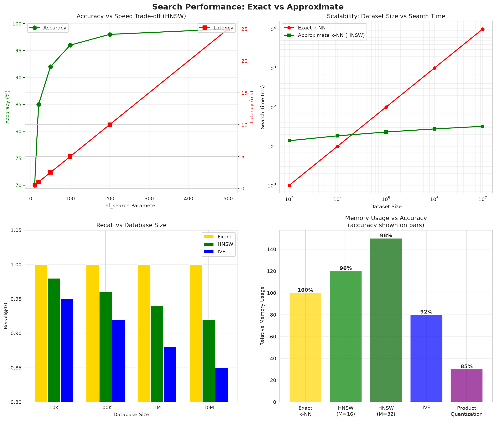

# Dense Vector Search Complete Guide

## Table of Contents
1. [Introduction](#introduction)
2. [Core Concepts](#core-concepts)
3. [Embedding Models](#embedding-models)
4. [Implementation Guide](#implementation-guide)
5. [Performance Characteristics](#performance-characteristics)
6. [Integration Examples](#integration-examples)
7. [Troubleshooting & Best Practices](#troubleshooting--best-practices)

---

## Introduction

### What is Dense Vector Search?

Dense vector search, also known as **semantic search**, converts text into high-dimensional vectors (embeddings) where semantically similar text is close together in vector space. Unlike keyword search which matches exact words, dense search understands **meaning** and **context**.

**Example:**
```
Query: "affordable smartphone"
- Keyword Search: Only finds documents with "affordable" AND "smartphone"
- Dense Search: Also finds "cheap phone", "budget mobile", "inexpensive device"
```

### Real-World Use Cases

| Use Case | Why Dense Search? | Example |
|----------|-------------------|---------|
| **Synonym Matching** | Finds related terms | "car" → "vehicle", "automobile" |
| **Multilingual Search** | Works across languages | "hello" → "hola", "bonjour" |
| **Conceptual Queries** | Understands intent | "fix error" → debugging guides |
| **Document Classification** | Groups similar content | Product categorization |
| **Question Answering** | Matches Q&A pairs | Customer support chatbots |

### When to Use Dense Search

✅ **Use dense search when:**
- Users query with natural language
- Synonyms and paraphrasing are common
- You need multilingual support
- Exact term matching is less important
- You have sufficient computing resources

❌ **Don't use dense search when:**
- Exact terms matter (SKUs, IDs, names)
- You need full interpretability
- Computing budget is very limited
- Keyword search already works well

---

## Core Concepts

### 1. Vector Embeddings Fundamentals



**What are embeddings?**

Embeddings transform text into fixed-size numerical vectors that capture semantic meaning:

```python
# Example embedding
text = "apple fruit healthy"
embedding = [0.712, -0.249, 0.914, ..., 0.102]  # 768 or 1024 dimensions

# Similar text has similar embeddings
text2 = "nutritious apple snack"
embedding2 = [0.698, -0.261, 0.889, ..., 0.115]  # Close in vector space
```

**Key Properties:**
- **Fixed dimension**: 384, 768, 1024, or 1536 dimensions
- **Dense**: All positions have non-zero values (unlike sparse vectors)
- **Semantic**: Similar meaning → similar vectors
- **Context-aware**: "apple" (fruit) vs "Apple" (company) have different embeddings

---

### 2. Similarity Metrics



Dense search uses distance/similarity metrics to compare vectors:

#### **Cosine Similarity** (Most Common)
- **Formula**: `sim(a,b) = (a·b) / (||a|| · ||b||)`
- **Range**: [-1, 1], where 1 = identical direction
- **Property**: Magnitude-invariant (document length doesn't matter)
- **Use**: Default for semantic search

#### **Euclidean Distance** (L2)
- **Formula**: `d(p,q) = √(Σ(qi - pi)²)`
- **Range**: [0, ∞), where 0 = identical
- **Property**: Sensitive to magnitude
- **Use**: Recommendation systems

#### **Dot Product**
- **Formula**: `a·b = ||a|| ||b|| cos(α)`
- **Range**: (-∞, ∞), higher = more similar
- **Property**: Combines magnitude and direction
- **Use**: Collaborative filtering

---

### 3. K-Nearest Neighbors (k-NN) Search



**How k-NN Works:**

1. **Index Phase**: Store all document embeddings in a vector database
2. **Query Phase**: 
   - Convert query to embedding
   - Calculate similarity to all documents
   - Return top-k most similar

```python
# Simplified k-NN algorithm
def knn_search(query_embedding, document_embeddings, k=10):
    similarities = []
    for doc_embedding in document_embeddings:
        sim = cosine_similarity(query_embedding, doc_embedding)
        similarities.append(sim)
    
    # Return top-k
    top_k_indices = argsort(similarities)[-k:]
    return top_k_indices
```

**Challenge**: Brute-force is slow for large datasets (millions of vectors)
**Solution**: Use approximate nearest neighbor algorithms (HNSW, IVF)

---

### 4. HNSW Indexing



**Hierarchical Navigable Small World (HNSW)** is the leading algorithm for fast approximate nearest neighbor search.

**How HNSW Works:**
- **Multi-layer graph**: Lower layers have more connections (fine-grained)
- **Greedy search**: Start at top layer, navigate down
- **Sub-linear time**: O(log n) instead of O(n)
- **Trade-off**: 95-99% accuracy with 10-100x speedup

**Configuration Parameters:**
```python
# HNSW parameters
M = 16                    # Max connections per layer (16-64)
ef_construction = 200     # Index-time exploration (100-400)
ef_search = 100          # Query-time exploration (50-300)
```

**Performance Impact:**
- **Higher M**: Better recall, more memory
- **Higher ef**: Better accuracy, slower search
- **Typical**: M=16, ef=100 for balanced performance

---

### 5. Dimensionality Reduction



High-dimensional embeddings (768-1536 dims) are hard to visualize and store. Reduction techniques help:

#### **Principal Component Analysis (PCA)**
- **Linear** transformation to lower dimensions
- Preserves **variance**
- Fast and deterministic

#### **t-SNE (t-Distributed Stochastic Neighbor Embedding)**
- **Non-linear** transformation
- Preserves **local structure** (clusters)
- Good for visualization, slow for large datasets

#### **UMAP (Uniform Manifold Approximation and Projection)**
- **Non-linear** transformation
- Preserves both **local and global** structure
- Faster than t-SNE, better for production

**Use Cases:**
- **Visualization**: Reduce to 2D/3D for plotting
- **Storage optimization**: 768 → 384 dimensions (50% reduction)
- **Speed**: Fewer dimensions = faster search

---

## Embedding Models

### AWS Bedrock Models (Recommended for Production)

#### **Amazon Titan Embed Text v2** ✅ Recommended
```python
model_id = "amazon.titan-embed-text-v2"
dimension = 1024
```

**Strengths:**
- Latest model with best quality
- Optimized for English text
- 1024 dimensions (balanced)
- Fully managed, auto-scaling

**Pricing** (as of 2024):
- $0.0001 per 1K input tokens
- ~$0.10 per 1M words

#### **Amazon Titan Embed Text v1**
```python
model_id = "amazon.titan-embed-text-v1"
dimension = 1536
```

**Strengths:**
- Higher dimensionality (1536d)
- Good for complex domains
- Previous generation

**Use when**: You need maximum quality and have storage capacity

#### **Cohere Embed English v3**
```python
model_id = "cohere.embed-english-v3"
dimension = 1024
```

**Strengths:**
- Alternative to Titan
- Strong performance on benchmarks
- Good for search/retrieval tasks

---

### Local Models (Free, Self-Hosted)

#### **all-mpnet-base-v2** ✅ Recommended for Local
```python
model_name = "all-mpnet-base-v2"
dimension = 768
```

**Strengths:**
- **Best quality** among local models
- 768 dimensions
- ~420MB model size
- ~140ms latency per query (CPU)

**Use when**: Best local quality, acceptable latency

#### **all-MiniLM-L12-v2** (Balanced)
```python
model_name = "all-MiniLM-L12-v2"
dimension = 384
```

**Strengths:**
- **Balanced** speed and quality
- 384 dimensions (50% smaller)
- ~120MB model size
- ~50ms latency per query (CPU)

**Use when**: Need faster local embedding

#### **all-MiniLM-L6-v2** (Fastest)
```python
model_name = "all-MiniLM-L6-v2"
dimension = 384
```

**Strengths:**
- **Fastest** local model
- 384 dimensions
- ~80MB model size
- ~25ms latency per query (CPU)

**Use when**: Speed is critical, quality can be slightly lower

#### **multi-qa-mpnet-base-dot-v1** (Q&A Optimized)
```python
model_name = "multi-qa-mpnet-base-dot-v1"
dimension = 768
```

**Strengths:**
- Optimized for **question-answer** matching
- Uses dot product similarity
- Best for chatbots, customer support

**Use when**: Building Q&A systems

---

### Model Comparison

| Model | Dimension | Size | Speed | Quality | Cost | Use Case |
|-------|-----------|------|-------|---------|------|----------|
| **Titan v2** | 1024 | Cloud | Fast | ⭐⭐⭐⭐⭐ | $$ | Production |
| **Titan v1** | 1536 | Cloud | Fast | ⭐⭐⭐⭐⭐ | $$$ | Max quality |
| **Cohere** | 1024 | Cloud | Fast | ⭐⭐⭐⭐⭐ | $$ | Alternative |
| **mpnet-base** | 768 | 420MB | Medium | ⭐⭐⭐⭐ | Free | Best local |
| **MiniLM-L12** | 384 | 120MB | Fast | ⭐⭐⭐ | Free | Balanced |
| **MiniLM-L6** | 384 | 80MB | Very Fast | ⭐⭐⭐ | Free | Speed |
| **multi-qa** | 768 | 420MB | Medium | ⭐⭐⭐⭐ | Free | Q&A |

---

## Implementation Guide

### Step 1: Initialize Embedding Generator

#### **Using AWS Bedrock** (Recommended for Production)

```python
from embeddings import BedrockEmbedding

# Initialize Bedrock embedding
embedding_gen = BedrockEmbedding(
    model_id="amazon.titan-embed-text-v2",
    region="us-east-1"
)

# Generate single embedding
text = "This is a sample document about machine learning"
embedding = embedding_gen.generate(text)

print(f"Embedding dimension: {len(embedding)}")  # 1024
print(f"First 5 values: {embedding[:5]}")
# Output: [0.0234, -0.0891, 0.1234, 0.0456, -0.0123]
```

#### **Using Local Models** (Free, Self-Hosted)

```python
from embeddings import LocalEmbedding

# Initialize local embedding
embedding_gen = LocalEmbedding(
    model_name="all-mpnet-base-v2"
)

# Generate single embedding
text = "This is a sample document about machine learning"
embedding = embedding_gen.generate(text)

print(f"Embedding dimension: {len(embedding)}")  # 768
```

---

### Step 2: Batch Processing (Efficient)

Always use batch processing for multiple documents:

```python
# Batch embedding generation (much faster)
documents = [
    "Machine learning is a subset of artificial intelligence",
    "Deep learning uses neural networks with many layers",
    "Natural language processing enables computers to understand text",
    "Computer vision allows machines to interpret images"
]

# Bedrock batch processing
embeddings = embedding_gen.batch_generate(documents, batch_size=25)

# Local batch processing (optimized with parallelization)
embeddings = embedding_gen.batch_generate(documents, batch_size=32)

print(f"Generated {len(embeddings)} embeddings")
# Output: Generated 4 embeddings
```

**Performance Tips:**
- **Bedrock**: Use batch_size=25 (AWS rate limit)
- **Local**: Use batch_size=32-64 (depends on RAM)
- **Batching** is 5-10x faster than individual calls

---

### Step 3: Calculate Similarity

```python
import numpy as np
from sklearn.metrics.pairwise import cosine_similarity

# Generate embeddings for query and documents
query = "What is AI?"
query_embedding = embedding_gen.generate(query)

documents = [
    "Artificial intelligence is the simulation of human intelligence",
    "Pizza is a popular Italian food",
    "Machine learning is a type of AI"
]
doc_embeddings = embedding_gen.batch_generate(documents)

# Calculate cosine similarity
query_vec = np.array(query_embedding).reshape(1, -1)
doc_matrix = np.array(doc_embeddings)

similarities = cosine_similarity(query_vec, doc_matrix)[0]

# Sort by similarity
results = sorted(
    zip(documents, similarities),
    key=lambda x: x[1],
    reverse=True
)

for doc, sim in results:
    print(f"[{sim:.3f}] {doc}")

# Output:
# [0.892] Artificial intelligence is the simulation of human intelligence
# [0.734] Machine learning is a type of AI
# [0.123] Pizza is a popular Italian food
```

---

### Step 4: Integration with Vector Database (Qdrant)

```python
from qdrant_client import QdrantClient
from qdrant_client.models import Distance, VectorParams, PointStruct

# Initialize Qdrant client
client = QdrantClient(url="https://your-cluster.cloud.qdrant.io", api_key="your-api-key")

# Create collection
collection_name = "documents"
client.create_collection(
    collection_name=collection_name,
    vectors_config=VectorParams(
        size=1024,  # Match embedding dimension
        distance=Distance.COSINE
    )
)

# Index documents
documents = [
    {"id": 1, "text": "Machine learning tutorial", "category": "tech"},
    {"id": 2, "text": "Cooking recipes", "category": "food"},
    {"id": 3, "text": "AI research paper", "category": "tech"}
]

# Generate embeddings
texts = [doc["text"] for doc in documents]
embeddings = embedding_gen.batch_generate(texts)

# Upload to Qdrant
points = []
for doc, embedding in zip(documents, embeddings):
    point = PointStruct(
        id=doc["id"],
        vector=embedding,
        payload={"text": doc["text"], "category": doc["category"]}
    )
    points.append(point)

client.upsert(collection_name=collection_name, points=points)

# Search
query = "artificial intelligence"
query_embedding = embedding_gen.generate(query)

results = client.search(
    collection_name=collection_name,
    query_vector=query_embedding,
    limit=5
)

for result in results:
    print(f"[{result.score:.3f}] {result.payload['text']}")

# Output:
# [0.887] AI research paper
# [0.734] Machine learning tutorial
# [0.145] Cooking recipes
```

---

### Step 5: Complete Search Example

```python
from embeddings import get_embedding_generator
from qdrant_client import QdrantClient
from qdrant_client.models import Distance, VectorParams, Filter, FieldCondition
import numpy as np

class DenseSearchEngine:
    def __init__(self, use_bedrock=True):
        # Initialize embedding generator
        self.embedding_gen = get_embedding_generator(use_bedrock=use_bedrock)
        self.dimension = self.embedding_gen.dimension
        
        # Initialize Qdrant
        self.client = QdrantClient(":memory:")  # In-memory for demo
        self.collection_name = "search_demo"
        
    def create_index(self):
        """Create vector collection"""
        self.client.create_collection(
            collection_name=self.collection_name,
            vectors_config=VectorParams(
                size=self.dimension,
                distance=Distance.COSINE
            )
        )
    
    def index_documents(self, documents):
        """Index documents with embeddings"""
        print(f"Indexing {len(documents)} documents...")
        
        # Generate embeddings in batch
        texts = [doc["text"] for doc in documents]
        embeddings = self.embedding_gen.batch_generate(texts)
        
        # Create points
        points = []
        for doc, embedding in zip(documents, embeddings):
            point = PointStruct(
                id=doc["id"],
                vector=embedding,
                payload=doc
            )
            points.append(point)
        
        # Upload to Qdrant
        self.client.upsert(
            collection_name=self.collection_name,
            points=points
        )
        
        print(f"✓ Indexed {len(documents)} documents")
    
    def search(self, query, k=10, filter_category=None):
        """Search for similar documents"""
        # Generate query embedding
        query_embedding = self.embedding_gen.generate(query)
        
        # Build filter if specified
        query_filter = None
        if filter_category:
            query_filter = Filter(
                must=[
                    FieldCondition(
                        key="category",
                        match={"value": filter_category}
                    )
                ]
            )
        
        # Search
        results = self.client.search(
            collection_name=self.collection_name,
            query_vector=query_embedding,
            limit=k,
            query_filter=query_filter
        )
        
        return results

# Usage example
if __name__ == "__main__":
    # Initialize search engine
    engine = DenseSearchEngine(use_bedrock=False)  # Use local model
    engine.create_index()
    
    # Sample documents
    documents = [
        {"id": 1, "text": "iPhone 15 Pro features advanced camera", "category": "tech"},
        {"id": 2, "text": "Healthy apple recipes for breakfast", "category": "food"},
        {"id": 3, "text": "MacBook Pro review 2024", "category": "tech"},
        {"id": 4, "text": "Artificial intelligence breakthrough", "category": "tech"},
        {"id": 5, "text": "Italian pasta cooking guide", "category": "food"}
    ]
    
    # Index documents
    engine.index_documents(documents)
    
    # Search
    query = "computer technology"
    results = engine.search(query, k=3)
    
    print(f"\nQuery: '{query}'")
    print("=" * 70)
    for result in results:
        print(f"[{result.score:.3f}] {result.payload['text']} ({result.payload['category']})")
```

---

## Performance Characteristics



### Quality Metrics

**NDCG@10 (Normalized Discounted Cumulative Gain)**:
- Dense Search: **0.85** ⭐⭐⭐⭐
- Keyword Search: 0.72
- Sparse Search: 0.74
- Hybrid Search: 0.91 (best)

**Recall@10**:
- Dense Search: **82%** (finds 82% of relevant docs in top 10)

### Latency Benchmarks

| Operation | Bedrock | Local (CPU) | Local (GPU) |
|-----------|---------|-------------|-------------|
| **Single Embedding** | 50ms | 140ms | 15ms |
| **Batch (32 docs)** | 200ms | 800ms | 80ms |
| **Search (1M docs)** | 45ms | 45ms | 45ms |

**Notes:**
- Bedrock includes network latency (30-40ms)
- Local CPU uses all-mpnet-base-v2
- Search time dominated by vector DB, not embedding

### Memory Requirements

| Dataset Size | Dimension | Memory (Uncompressed) | Memory (Quantized) |
|--------------|-----------|----------------------|--------------------|
| 10K docs | 1024 | 40 MB | 10 MB |
| 100K docs | 1024 | 400 MB | 100 MB |
| 1M docs | 1024 | 4 GB | 1 GB |
| 10M docs | 1024 | 40 GB | 10 GB |

**Memory Optimization:**
- **Product Quantization**: 4-8x reduction with minimal quality loss
- **Scalar Quantization**: 2-4x reduction
- **Dimension Reduction**: 768 → 384 dims (50% saving)

### Cost Analysis (AWS Bedrock)

**Embedding Cost:**
- $0.0001 per 1K tokens
- Average doc = 500 tokens = $0.00005
- 1M documents = $50

**Vector DB Cost (OpenSearch Serverless):**
- OCU (Indexing): ~$0.24/hour
- OCU (Search): ~$0.24/hour
- 1M docs ≈ 2 OCU = $350/month

**Total Cost:**
- Indexing: $50 (one-time)
- Runtime: $350/month (search infrastructure)
- **Per query**: ~$0.0001 (negligible)

---

## Integration Examples

### Example 1: Document Q&A with Claude

```python
from embeddings import BedrockEmbedding
from qdrant_client import QdrantClient
import boto3
import json

class DocumentQA:
    def __init__(self):
        self.embedding_gen = BedrockEmbedding()
        self.client = QdrantClient(":memory:")
        self.bedrock_runtime = boto3.client('bedrock-runtime', region_name='us-east-1')
        
    def answer_question(self, question, k=5):
        """Answer question using RAG (Retrieval-Augmented Generation)"""
        # 1. Retrieve relevant documents
        query_embedding = self.embedding_gen.generate(question)
        results = self.client.search(
            collection_name="documents",
            query_vector=query_embedding,
            limit=k
        )
        
        # 2. Build context from retrieved docs
        context = "\n\n".join([
            f"Document {i+1}: {r.payload['text']}"
            for i, r in enumerate(results)
        ])
        
        # 3. Generate answer with Claude
        prompt = f"""Based on the following documents, answer the question.

Documents:
{context}

Question: {question}

Answer:"""
        
        response = self.bedrock_runtime.invoke_model(
            modelId="anthropic.claude-sonnet-4-6-v1:0",
            contentType="application/json",
            accept="application/json",
            body=json.dumps({
                "anthropic_version": "bedrock-2023-05-31",
                "max_tokens": 1024,
                "messages": [
                    {"role": "user", "content": prompt}
                ]
            })
        )
        
        response_body = json.loads(response['body'].read())
        answer = response_body['content'][0]['text']
        
        return {
            'answer': answer,
            'sources': [r.payload for r in results]
        }

# Usage
qa_system = DocumentQA()
result = qa_system.answer_question("How does machine learning work?")
print(f"Answer: {result['answer']}")
print(f"Sources: {len(result['sources'])} documents")
```

### Example 2: Multilingual Search

```python
# Dense embeddings work across languages!
documents = [
    {"text": "Hello, how are you?", "lang": "en"},
    {"text": "Hola, ¿cómo estás?", "lang": "es"},
    {"text": "Bonjour, comment allez-vous?", "lang": "fr"},
    {"text": "Guten Tag, wie geht es Ihnen?", "lang": "de"}
]

# Query in English, find all greetings
query = "greeting someone politely"
query_embedding = embedding_gen.generate(query)

# All documents will have high similarity despite different languages
# (assuming multilingual embedding model like Cohere Multilingual)
```

### Example 3: Hybrid Search Integration

```python
# Combine dense search with other methods for best results
from hybrid_search import HybridSearchEngine, HybridSearchConfig

config = HybridSearchConfig(
    keyword_weight=0.3,
    sparse_weight=0.3,
    dense_weight=0.4  # Dense search gets highest weight
)

hybrid_engine = HybridSearchEngine(config)
hybrid_engine.fit(documents)

results = hybrid_engine.search("expensive Apple products", k=10)
# Combines keyword matching + sparse encoding + dense semantic search
```

---

## Troubleshooting & Best Practices

### Common Issues

#### Problem: Low Similarity Scores
```python
# Issue: Scores are all very low (< 0.3)
# Cause: Query and documents are from different domains

# Solution: Fine-tune embeddings on your domain
# OR use domain-specific embedding model
```

#### Problem: Slow Embedding Generation
```python
# Issue: Local embeddings take too long
# Solution 1: Use smaller model (MiniLM-L6)
# Solution 2: Use GPU acceleration
# Solution 3: Switch to Bedrock

# GPU acceleration
from sentence_transformers import SentenceTransformer
model = SentenceTransformer('all-mpnet-base-v2', device='cuda')
```

#### Problem: High Memory Usage
```python
# Issue: 10M documents use 40GB RAM
# Solution: Enable product quantization

from qdrant_client.models import VectorParams, Distance, QuantizationConfig
client.create_collection(
    collection_name="documents",
    vectors_config=VectorParams(
        size=1024,
        distance=Distance.COSINE
    ),
    quantization_config=QuantizationConfig(
        scalar={"type": "int8", "quantile": 0.99}
    )
)
# Reduces memory by 4x with minimal quality loss
```

### Best Practices

#### 1. Text Preprocessing
```python
# Good: Clean text before embedding
def preprocess(text):
    text = text.strip()
    text = text.lower()  # Normalize case
    text = re.sub(r'\s+', ' ', text)  # Remove extra whitespace
    return text

embedding = embedding_gen.generate(preprocess(text))
```

#### 2. Chunk Long Documents
```python
# Good: Split long documents into chunks
def chunk_document(text, chunk_size=500, overlap=50):
    words = text.split()
    chunks = []
    for i in range(0, len(words), chunk_size - overlap):
        chunk = ' '.join(words[i:i + chunk_size])
        chunks.append(chunk)
    return chunks

# Index each chunk separately
for doc in documents:
    chunks = chunk_document(doc['text'])
    for i, chunk in enumerate(chunks):
        embedding = embedding_gen.generate(chunk)
        # Index with doc_id + chunk_id
```

#### 3. Cache Embeddings
```python
# Good: Don't re-compute embeddings
import pickle

# Save embeddings
with open('embeddings.pkl', 'wb') as f:
    pickle.dump(embeddings, f)

# Load embeddings
with open('embeddings.pkl', 'rb') as f:
    embeddings = pickle.load(f)
```

#### 4. Use Filters for Speed
```python
# Good: Filter before vector search
results = client.search(
    collection_name="documents",
    query_vector=query_embedding,
    query_filter=Filter(
        must=[
            FieldCondition(key="category", match={"value": "tech"}),
            FieldCondition(key="year", range={"gte": 2020})
        ]
    ),
    limit=10
)
# Searches only tech documents from 2020+, much faster
```

#### 5. Monitor Quality
```python
# Good: Track search quality over time
def calculate_ndcg(results, relevant_ids):
    """Calculate NDCG@k metric"""
    dcg = 0
    for i, result in enumerate(results):
        if result.id in relevant_ids:
            dcg += 1 / np.log2(i + 2)
    
    # Ideal DCG (all relevant docs at top)
    idcg = sum(1 / np.log2(i + 2) for i in range(len(relevant_ids)))
    
    return dcg / idcg if idcg > 0 else 0

# Track NDCG weekly
ndcg_score = calculate_ndcg(search_results, ground_truth)
print(f"NDCG@10: {ndcg_score:.3f}")
```

### When NOT to Use Dense Search

❌ **Don't use dense search for:**

1. **Exact Matching**: 
   - SKUs, product codes, IDs
   - Use: Keyword search or database index

2. **Structured Queries**:
   - "price < $100 AND color = red"
   - Use: SQL or filtered keyword search

3. **Extremely Low Latency** (<5ms):
   - Real-time autocomplete
   - Use: In-memory keyword index

4. **Interpretability Required**:
   - Legal, compliance, medical
   - Use: Sparse encoding or keyword search

5. **Very Limited Resources**:
   - <1GB RAM, no GPU
   - Use: Keyword search

---

## Summary

### Key Takeaways

✅ **Dense vector search excels at:**
- Semantic understanding and synonym matching
- Multilingual and cross-lingual search
- Question answering and conversational queries
- Document classification and clustering

✅ **Best practices:**
- Use Bedrock for production (managed, scalable)
- Use local models for development/testing
- Always batch embed for efficiency
- Chunk long documents (500-1000 words)
- Enable quantization for memory savings
- Combine with keyword/sparse for hybrid search

✅ **Production checklist:**
- [ ] Choose embedding model (Bedrock vs local)
- [ ] Set up vector database (Qdrant, OpenSearch)
- [ ] Configure HNSW parameters (M=16, ef=100)
- [ ] Enable quantization if >1M documents
- [ ] Implement monitoring (NDCG, latency)
- [ ] Plan for scaling (sharding, replicas)

---

### Next Steps

1. **Try the demos**: Run `demo_local.py` and `test_search.py`
2. **Integrate with Qdrant**: See `QDRANT_SETUP.md`
3. **Compare with other methods**: See `HYBRID_SEARCH_COMPLETE_GUIDE.md`
4. **Deploy to production**: See `DEPLOYMENT.md`

### Related Guides

- **[Sparse Encoding Guide](./SPARSE_ENCODING_COMPLETE_GUIDE.md)** - Fast, interpretable alternative
- **[Hybrid Search Guide](./HYBRID_SEARCH_COMPLETE_GUIDE.md)** - Combine multiple methods
- **[Distance Metrics Guide](./DISTANCE_METRICS_COMPLETE_GUIDE.md)** - Deep dive into similarity metrics

---

**Questions?** Open an issue or check the main [README.md](./README.md)
